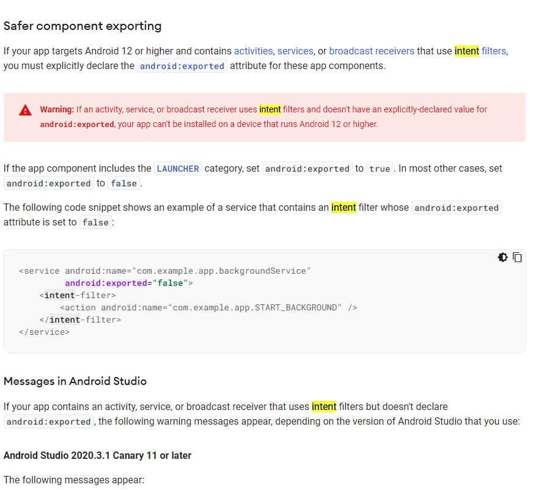
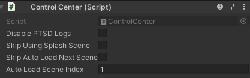
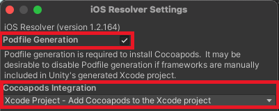
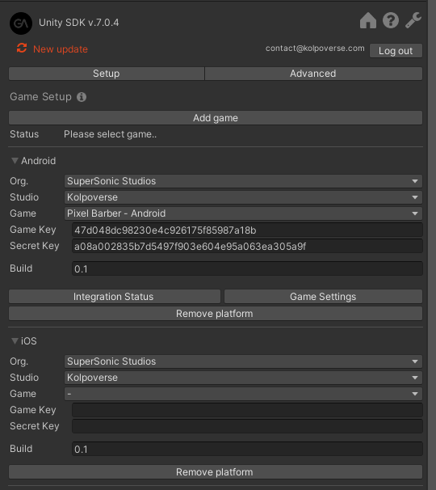
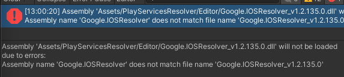
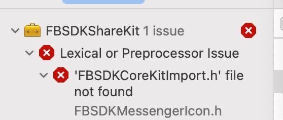

# PTSDKit
This repository is maintained with the motivation of making SDK integration easier or faster for the developers of Kolpoverse. Please follow the document and keep an eye out for changes when making a new integration. For any queries or feedbacks feel free to give me a knock!

### Quick Links:
* [Getting Started](#getting-started)
* [Building For Android](#building-for-android)
* [About Analytics](sdk_docs/analytics_assistant/README.md)
* [SDKs](#sdk-quick-walkthroughs)
  * Facebook: [Full Doc](sdk_docs/facebook/README.md) or [Checklist](#facebook)
  * APPSFlyer: [Full Doc](sdk_docs/appsflyer/README.md) or [Checklist](#appsflyer) 
  * GameAnalytics: [Full Doc](sdk_docs/game_analytics/README.md) or [Checklist](#gameanalytics) 
* [Additional Features](#additional-features)
* [Building For iOS](#building-for-ios)

## Getting Started
#### Environment Setup
* Make sure you are using minimum recommended Unity version: 2021.3.13f
* Setup your project properly at the beginning (to avoid future complications)
  * packageName or bundleID.  
  * Version and bundle version code (both will change with submissions)
  * Download and import the latest **[External Dependency Manager](https://github.com/googlesamples/unity-jar-resolver/raw/master/external-dependency-manager-latest.unitypackage)**
  * Game orientation is in portrait (or whichever is applicable for your game)
  * (Android) Scripting backend =  IL2CPP
  * (Android) target architectures = armv7 and arm64
  * (Android) target API level = 31 (31 is needed for MAXSDK v5.4+)
  
  * (Android) Edit the android manifest according to the following image. But you can use `android:exported= "true"` to be on the safe side.
  
  * (Android) Sign your application and create a signed build. 
  * (Android) If you have an android manifest you should change the debuggable attribute to false
* While copying IDs or keys (e.g. ad unit ID, app token etc) make sure to check for white space characters on both end of the key
* You might want to add [logs-viewer](https://assetstore.unity.com/packages/tools/integration/log-viewer-12047) package for viewing logs on mobile devices

#### Using PTSDKit
* Download the PTSDKit. Check in the release section for latest package.
* Import the PTSDKit unitypackage to your project. 
* You can use the “PTSDKit” menu to “Open Config Prefab” and access wrappers relevant to your implementation.
* You can activate modules after importing relevant SDKs. 
* The activate button is platform dependent (if you  activate for android, you will still need to activate when you move to iOS).
* Recommended to allow using the PTSDKit to add a loading scene when prompted.

#### “External Dependency Manager(EDM)”/”Play Service Resolver(PSR)” 
###### Management
* If you are starting a new project according to the current guidelines (as of 08/12/2021) you should already have the latest version of the EDM in your project
* If your project already has an older version:
  * First, delete all current EDM or PSR folders,
  * Download the latest version from the link and import it. [Latest Version Link](https://github.com/googlesamples/unity-jar-resolver/raw/master/external-dependency-manager-latest.unitypackage).
* Always check when you import a new package, if it includes a version External Dependency Manager and/or Play Service Resolver. If it does, make sure you uncheck the whole folders

###### Background
External Dependency Manager helps you in managing platform specific libraries (android/iOS). Play Service Resolver is the previous name of External Dependency Manager. Many sdks (Facebook,Max, Firebase etc) comes with a version of EDM or PSR. We will maintain in our projects the latest version of External Dependency Manager. 

## Build Guidelines For Platforms
The PTSDKit is prepared with the assumption that the builds are usually stabilized in android before iOS. The following sections describes the recommended practice while building for android. The next section describes SDKs and feature specific workflows, followed by a section on iOS build practices.

## Building For Android
### Situations to Delete and Resolve Libraries
When working on android check for the following situations:
* Any new sdk package imported or upgraded (if you are confident that the package does not contain native android code, you can skip this)
* Change to bundle id
* Change to gradle/android manifest (usually due to new package import or update)
* Working on a new computer

If any of the situations arise please make sure you do the following:
* Assets/External Dependency Manager/Android Resolver/ Delete Resolved Libraries
* Assets/External Dependency Manager/Android Resolver/ Resolve

### Before Build Submission
* Your android manifest must have the following attribute inside its application element. `android:debuggable="false"`
* Max Upgrade: If applicable upgrade max plugin, and all the mediated network that needs upgrade.After that delete all resolved libraries and resolve again.
---

## SDK and Feature specific walkthrough

### About Analytics:
The analytics platforms that are used for games are constantly changing. On the other hand,  specific calls and its format can vary from game to game. The number of platform to be targeted for a specific analytics call can vary between diffrent types of analytics calls. Thus, for analytics calls you will have to make your calls according to the documentation of each SDK that you need (PTSDKit does have a minimal wrapper for common analytics calls, however you should know which specific calls to make and if the wrapper does that. PTSDKit will handle initialization of  the SDKs). You need to`verify with your PM` which analytics logs you need to send (and to which platform). The support that is provided currently is detailed here: 

[Analytics Assistant](sdk_docs/analytics_assistant/README.md)

#### About Analytics PTSDKit Loading Scene:
PTSDKit provides a loading `splash scene` which **is recommended** to use. Depending on whether you are using it or not you have
* **Without Loading Scene:**  You have to make sure that the `ControlCenter.isReady` flag is true before making any calls on any analytics.
* **With Loading Scene:** In this case you can safely make the calls to any analytics on any scene loaded afterward. But if you choose to extend the provided loading scene, you still have to check if `ControlCenter.isReady` is true.
---
### SDK Quick Walkthroughs
Here are the mandatory steps for testing phase of each SDK. The SDKs in question are primarily documented for the android platform, additional steps for iOS are noted in the next section. When you are done with all the steps dont forget to Delete and Resolve Libraries(EDM or PSR) before building.

#### Facebook
[Full doc](sdk_docs/facebook/README.md)
* Download and import
* Say yes to the consent request.
* Activate PTSDKit facebook Wrapper
* Insert facebook app id and client token in Facebook Settings Window (Menu:  Facebook/Edit Settings). Get this id  from your FB dashboard.

#### AppsFlyer
[Full Doc](sdk_docs/appsflyer/README.md)

#### GameAnalytics
[Full Doc](sdk_docs/game_analytics/README.md)
  
### Additional Features
* **Splash Screen** 
  
  Quick Guide:
  * You will be prompted to add the Splash Scene provided with PTSDKit. Using this ensures all the SDKs are ready for use when you get to your main game scene.
  * You can choose which scene is loaded next at PTSDKit root object by changing "Auto Load Scene Index". (build index 1 is loaded by default)
  
  
  * If you want to manage loading next scene from the splash screen by yourself
    1. You must make sure that `ControlCenter.isReady` flag returns true before leaving the splash screen.
    2. You should enable the option "Skip Auto Load Next Scene" (this tells PTSDKit that you will manage your own loading and it shouldnt load a default scene)
  * If you need, you can make use of the splash screen to initiate or preload gameplay assets(or similar tasks).
    * For basic tasks (e.g creating Pools) you can just add gameobjects/prefabs to the scene
    * For tasks that require more than one frame, you should "Skip Auto Load Next Scene" and then only load the next scene when `ControlCenter.isReady` and your task is complete. 

---
# Building For iOS
Additional steps while building for iOS are noted in this section. It's recommended that you stabilize your android build prior to moving to iOS.

#### About the recommended iOS Build Process:
*This process is recommended since this can avoid some common issues in a more automated process and also makes some issues more solvable. (for example “broken pod installation” avoiding, “FB Lexical Preprocessor” solve)*

### First Time Build Specific:

* “Play Service Resolver(PSR)/External Dependency Manager(EDM)”: (if your having errors after opening project for IOS check troubleshooting point 1)
  * Do not run “install cocoapods” in EDM/PSR
  * This is what the iOS Resolver settings should look like
    
    
* If you are using firebase don't forget to drag and drop **“GoogleService-Info.plist”** file in your asset folder.
* If you are using Game Analytics please click “Widnow/GameAnalytics/SelectSettings” and check if the iphone platform is already added or not.  If not add it by either getting keys from your PM or logging in to GA and selecting the right game.
  
  

### General Build Checklist
1. Check if all the wrappers are properly configured (you have to enable them the first time you are using that specific wrapper on iOS)
2. Choose `Build` instead  of “Build and Run”
3. Recommended to build in a newly created folder. (Append might work, but more risky)
4. Right click on the build folder and choose “New Terminal at Folder”.
5. (Check troubleshooting #2 if you are using FB before you do this)Run command `pod install`. (will generate workspace file)
6. Open workspace file and sign application and run it on device.

### Common iOS Troubleshooting:
#### 1. iOS Resolver Name Mismatch

* The error shows a common issue in many Unity 2021.x.x versions. The solution is to rename all IOSResolver files
  
  * Google.IOSResolver`_v1.2.135.0`.dll => Google.IOSResolver.dll 
  * Google.IOSResolver`_v1.2.135.0`.dll.meta => Google.IOSResolver.dll.meta
  * Google.IOSResolver`_v1.2.135.0`.dll.mdb => Google.IOSResolver.dll.mdb
  * Google.IOSResolver`_v1.2.135.0`.dll.mdb.meta => Google.IOSResolver.dll.mdb.meta
* An alternate solution to the above is to completely replace current EDM or PSR with the latest version of EDM. You can get the latest version from this [link](https://github.com/googlesamples/unity-jar-resolver/blob/master/external-dependency-manager-latest.unitypackage)
#### 2. Lexical or Preprocessor Issue (FB)

* If you have **Facebook SDK 11.0.0** you will see this error when you build from xcode.  	
* To fix this follow these steps
  * Open the build folder after building from unity
  * Edit the **Podfile**, you will need to change the version of each facebook related pod version to `11.1.0` from 11.0.0.
    
  * Save the pod file
  * Run terminal at the build folder and `pod install`.
  * Continue with your build according to the build guidelines.

[Back To Top](#PTSDKit)

