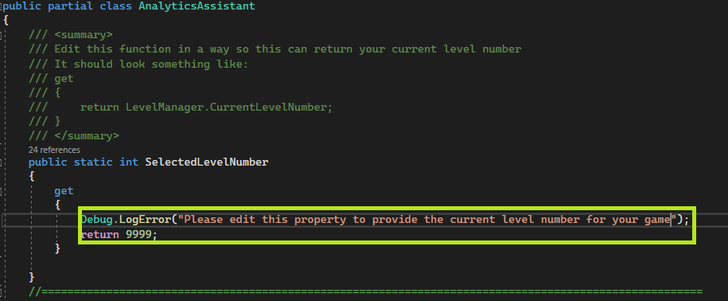
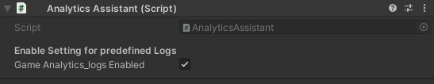

[Go Back To Main Page](../../README.md)
## Analytics SDK Integration:
You can follow the relevant sections from the main doc page to find instructions regarding integrating individual SDKS. (GA, ByteBrew, Lion etc..)

## Managing Analytics:
* The analytics platforms that are used for games are constantly changing. On the other hand,  specific calls and its format can vary from game to game. The number of platform to be targeted for a specific analytics call can vary between diffrent types of analytics calls. Thus, for analytics calls you will have to make your calls according to the documentation of each SDK that you need (PTSDKit does have a minimal wrapper for common analytics calls, however you should know which specific calls to make and if the wrapper does that. PTSDKit will handle initialization of  the SDKs). You need to`verify with your PM` which analytics logs you need to send (and to which platform). As of `02/12/22` we are only required to make calls using  “GameAnalytics” and "ByteBrew". 

* PTSDKit provides a loading `splash scene` which **is recommended** to use. Depending on whether you are using it or not you have
  * **Without Loading Scene:**  You have to make sure that the `PTSDKit.isReady` flag is true before making any calls on LionAnalytics.
  * **With Loading Scene:** In this case you can safely make the calls to Any Analytics from any scene loaded afterward. But if you choose to extend the provided loading scene and make calls inside the loading scene, you still have to check if `PTSDKit.isReady` is true.

## Analytics Assistant
PTSDKit provides a Analytics Assistant, which is optional to use and contains some predefined set of analytics calls. Also Lion RV analytics module directly depend on this module to provide current level numbers. 

### Making Use of Analytics Assistant
* Enable The Analytics Assistant Module from PTSDKit
* Edit the script named `AnalyticsAssistant_Modified` to make sure the property shown in the image returns your current level number (In case you ever reimport PTSDKit, uncheck this from import list) 
    
* The enabled module contains some basic Analytics calls like: LevelStart, LevelComplete etc. You can call them in the following format: `AnalyticsAssistant.Instance.LevelStarted()`
* The PTSDKit module of Analytics Assistant contains some toggles which works on predefined functions only.
    
* You can use the `AnalyticsAssistant_Modified` script to add your own analytics script. you can follow the functions to get an idea

[Go Back To Main Page](../../README.md)
