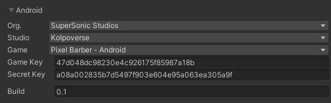
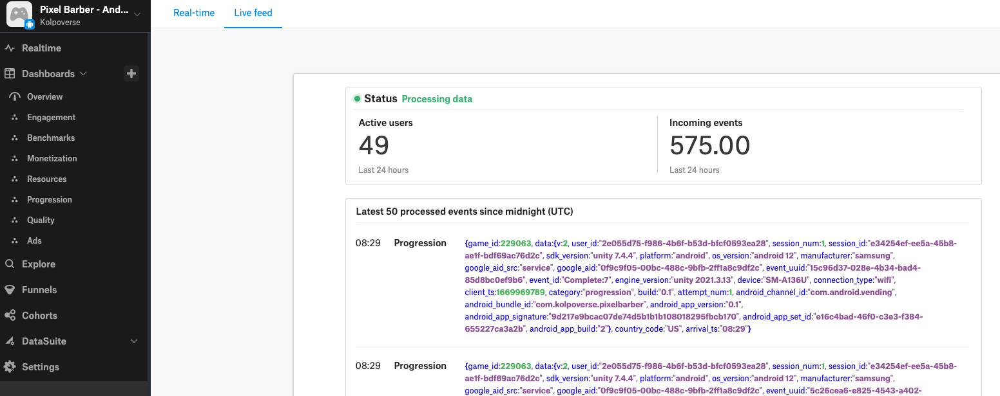

[Go Back To Main Page](../../README.md)
## GameAnalytics Integration:
* Get the latest Game Analytics unity sdk from: [here](https://download.gameanalytics.com/unity/GA_SDK_UNITY.unitypackage). 
* Import the SDK and Activate PTSDKit GameAnalytics wrapper
* Goto `Window/GameAnalytics/Select Settings`
* Login with 
    * id: contact@kolpoverse.com
    * pass: kolpoP@55code
* Add platform with android selected(you can add ios as well when applicable or you can do this before building for iOS). And fill it in like the screen shot
    * Game should be your game name, the keys will autofill.
    
       
    * Alternatively you can enter the game key and secret key only provided by your PM

### Testing GameAnalytics Integration:
* Enable Test Analytics in your GA wrapper of PotatoSDK
* Build and run
* Goto https://go.gameanalytics.com/home and login (same credentials)
    * Find your app and go to live feed
    * Search for testevent or timepassed design event  in the page.
      
* Disable Test Analytics when you are done testing

[Go Back To Main Page](../../README.md)
